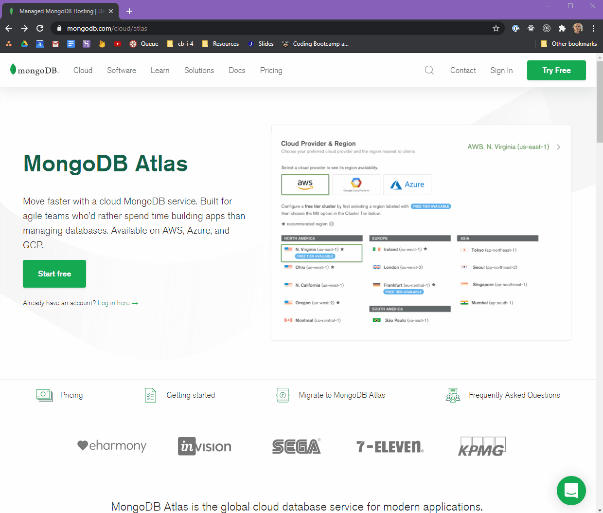
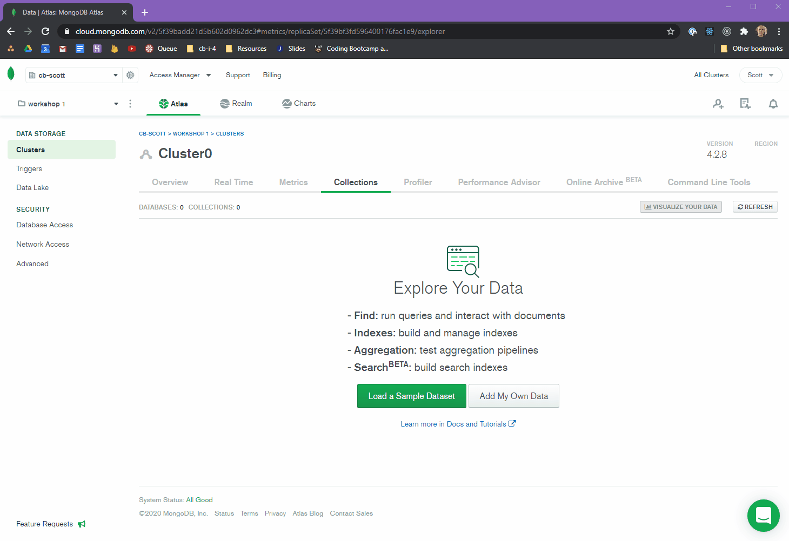
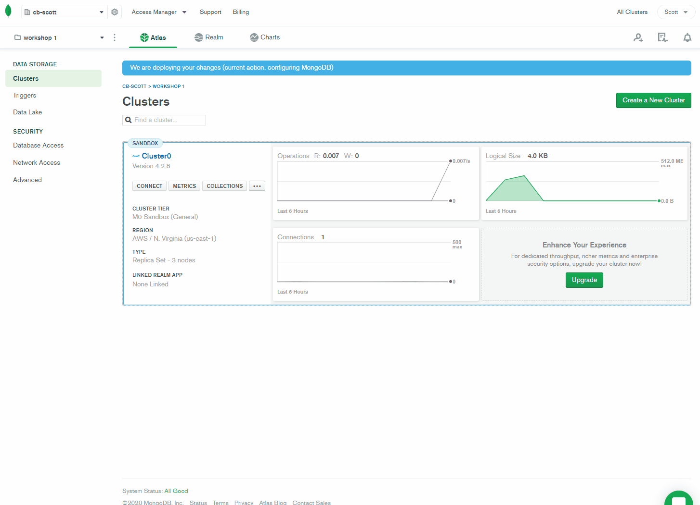

# Introduction to MongoDB

## Setup

```
yarn install
```

## Setup MongoDB Atlas Account

For the MongoDB workshops, we will be using mongoDB Atlas. It is a cloud DB service.

Go to [mongodb.com](https://www.mongodb.com/cloud/atlas) and click **Start Free**.

Use the google signin to accelerate the process.

1. Sign up with Google
2. Accept Privacy Plicy and Terms...
3. Create an organization
4. Create a project
5. Build a cluster
6. Choose the FREE tier
7. Accept the default settings

_...your cluster is being created_ (This can take a few minutes.)



## Create a Database

- Create a database called `exercise_1`
- Create a collection called `users`



## Access credentials to the database

### Create a Database user

1. Select 'Database Access' from the sidebar
2. Add a new Database User
   - Use `Password` for the authentication method.
   - create a username and password (use the `Autogenerate Secure Password` option)
   - copy that password and paste it somewhere temporarily.

### Access the database

1. Select `Clusters` from the sidebar.
2. Click on `Connect` in the cluster box.
3. Whitelist your i.p. address.
4. Choose a connection method.
   - Use the second method: _Using MongoDB's native drivers._



In the last pane, there is a code snippet. In that code snippet, there is a `uri`. It will look something like this.

```js
const uri =
  "mongodb+srv://user31:<password>@cluster0.9oceg.mongodb.net/<dbname>?retryWrites=true&w=majority";
```

1. Create a `.env` file
2. Add the uri to that file.

```
MONGO_URI=mongodb+srv://user31:<password>@cluster0.9oceg.mongodb.net/<dbname>?retryWrites=true&w=majority
```

**Replace `<password>` and `<dbname>` with actual values.**

- `<password>` is the password you assigned to the user you created in the previous step.
- `<dbname>` is the name of the database.

---

## Exercises

### Exercise 1.1

Open this exercise file: [exercise-1.1.md](__workshop/exercise-1.1.md)

### Exercise 1.2

Open this exercise file: [exercise-1.2.md](__workshop/exercise-1.2.md)

### Exercise 1.3

Open this exercise file: [exercise-1.3.md](__workshop/exercise-1.3.md)

### Exercise 1.4

Open this exercise file: [exercise-1.4.md](__workshop/exercise-1.4.md)

### Exercise 2.1

Open this exercise file: [exercise-2.1.md](__workshop/exercise-2.1.md)

### Exercise 2.2

Open this exercise file: [exercise-2.2.md](__workshop/exercise-2.2.md)

### Exercise 2.3

Open this exercise file: [exercise-2.3.md](__workshop/exercise-2.3.md)

### Exercise 2.4

Open this exercise file: [exercise-2.4.md](__workshop/exercise-2.4.md)

### Exercise 2.5

Open this exercise file: [exercise-2.5.md](__workshop/exercise-2.5.md)

### Exercise 2.6

Open this exercise file: [exercise-2.6.md](__workshop/exercise-2.6.md)

