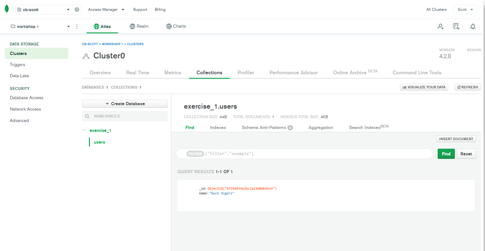

## Exercise 1.1 - Connect to your Mongo database.

1. Create a new folder called `📁 exercises`.
2. In that folder, create a file called `exercise-1.1.js`

Next, we need to write some code that will connect us to the mongo database server.

We need to require the MongoClient like so at the top of the file.

```js
const { MongoClient } = require("mongodb");
```

In order to access the database, we need the `uri` that we saved in the `.env` file.

```js
require("dotenv").config();
const { MONGO_URI } = process.env;
```

3. Now we'll create a function that will
   - accept one argument: `dbName`
   - create the `client`
   - connect to the database server
   - disconnect from the server

```js
const options = {
  useNewUrlParser: true,
  useUnifiedTopology: true,
};

const dbFunction = async (dbName) => {
  // creates a new client
  const client = await MongoClient(MONGO_URI, options);

  // connect to the client
  await client.connect();

  // connect to the database (db name is provided as an argument to the function)
  const db = client.db(dbName);
  console.log("connected!");

  // close the connection to the database server
  client.close();
  console.log("disconnected!");
};
```

4. In order to test this function, call it at the bottom of the file. Don't forget to pass it the database name as an argument.
5. Run this file from a new Terminal window. _Use the VS Code terminal for this_.

```bash
node exercises/exercise-1.1.js
```

If you see this in the terminal, it means that it worked.

```
connected!
disconnected!
```

Let's got one step further and add some data to this empty collection.

Add this line after `connect`ing to the database but before the `close` method.

```js
await db.collection("users").insertOne({ name: "Buck Rogers" });
```

Take a look at your mongoDB Atlas account. (_You may need to reload the page._) You should see the data you inserted right there!



W00T!!!
