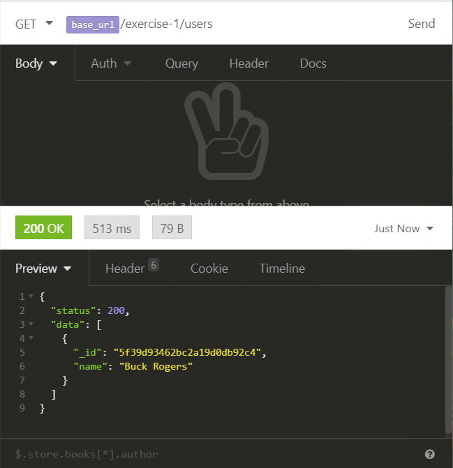

# Exercise 1.3 - Hooking this up for real!

1. In `server.js`, create a `get` endpoint that at `/exercise-1/users`.

We've already written a function that will get the data in `1.2`. Let's reuse that here.

2. Copy the contents of `exercise-1.2.js` into a new file `exercise-1.3.js`.
3. Change the name of the function to `getUsers` and export it instead of calling it.
4. Convert this function into a function that will handle `req`uests.

There are multiple ways of writing this function to return the data. Since `.find()` without any arguments returns _all_ of the data in a collection, let's do something like this:

- If there the array returned from the database is empty, `res`pond with `404`.
- If there is data in the array, `res`pond with a `200` and the data.

Once you are done connecting and retrieving data from the server, remember to `close` the connection...

Once you feel that you've got this all wired up, try start the server and try it out in Insomnia. _Dont't forget to do `yarn dev` to start up your server._

