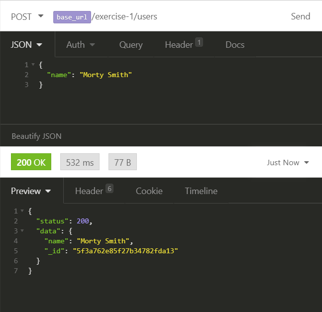

# Exercise 1.4 - Add users

1. In `server.js`, create a `post` endpoint that at `/exercise-1/users`.
2. In `exercise-1.4.js` create a function called `addUser` that will accept the `req`uest and add a document to the user collection. _Look back at 1.1 to see how we added data to the database._
3. Don't forget to respond to the `req` with a `201`.

Try it out with Insomnia!

Once you've got it working, do another GET to retrieve all of the users.
